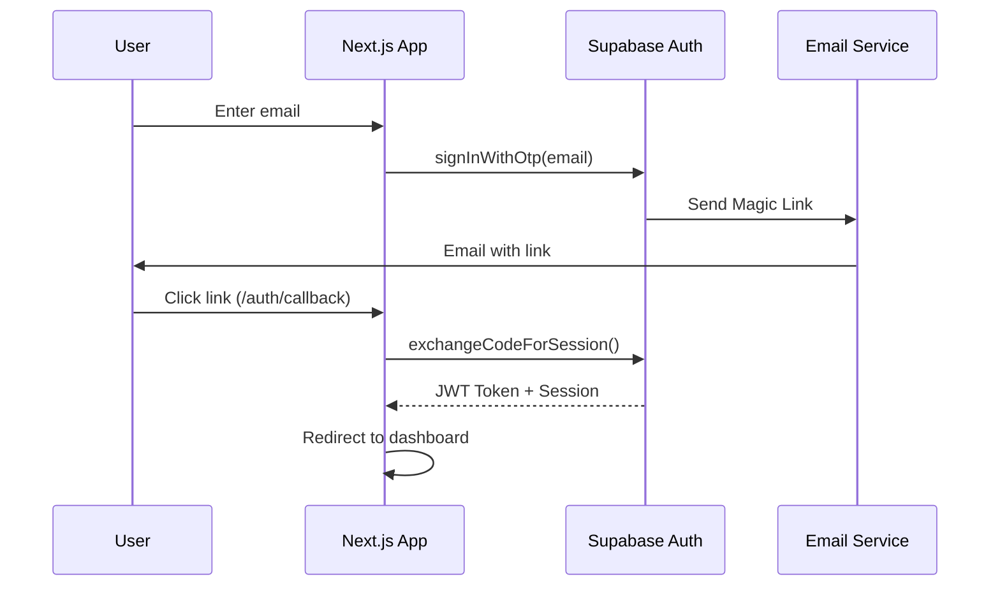

# Authentication

## Overview

Authentication system based on Supabase Auth with Magic Link for secure passwordless experience.

## Magic Link Flow

## Core Components

- **AuthProvider**: React Context for user state management
- **Middleware**: Automatic route protection for Next.js
- **Zustand Store**: Global authentication state
- **nuqs**: URL parameter management (redirectTo, invitation)

## Key Features

- **Simple Registration**: Email → Magic Link → Automatic connection
- **Invitations**: Invitation token → Automatic acceptance on login
- **Route Protection**: Next.js middleware + Supabase Row Level Security
- **Rate Limiting**: 5 attempts per minute via Upstash Redis
- **Validation**: Zod schemas for strict email validation
- **Notifications**: Welcome and invitation emails via Resend

## Security

- **JWT Auto-refresh**: Automatic token management
- **CSRF Protection**: Built-in Supabase Auth protection
- **Row Level Security**: User data isolation
- **Email Validation**: Format verification and allowed domains

## Related Documentation

- See [architecture.md](./architecture.md) for overall system design
- See [user-management.md](./user-management.md) for roles and permissions
- See [invitation-system.md](./invitation-system.md) for invitation flows

The system provides a smooth user experience while maintaining a high level of security.
