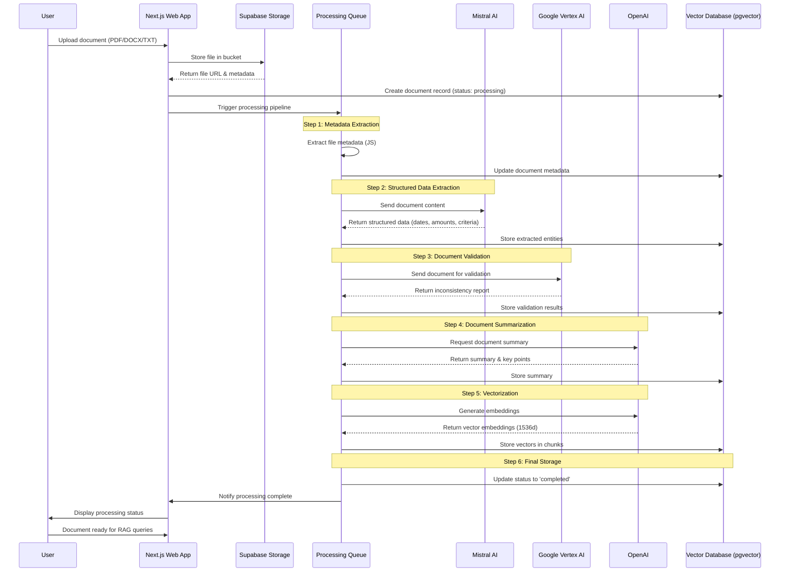

# Document Processing Flow

## Overview

This document describes the complete document processing pipeline in Exodia, from initial upload to vectorization and storage in the RAG system. The process consists of 7 sequential steps that transform uploaded documents into searchable, analyzable content.

## Processing Pipeline

### Step 1: Document Metadata Extraction

- **Task**: `analysisDocument`
- **Tool**: JavaScript/Native
- **AI Model**: Not required
- **Description**: Extracts basic document metadata (filename, size, type, upload timestamp)
- **Output**: Document metadata object

### Step 2: Structured Data Extraction

- **Task**: `extractionData`
- **Tool**: Mistral AI
- **AI Model**: `mistral-small-latest`
- **Description**: Automatically identifies key information in documents (dates, amounts, criteria, entities)
- **Output**: Structured data objects with extracted entities

### Step 3: Document Validation & Inconsistency Detection

- **Task**: `documentValidation`
- **Tool**: Google Vertex AI
- **AI Model**: `gemini-1.5-flash`
- **Description**: Detects inconsistencies, contradictions, and potential issues within the document
- **Output**: Validation report with flagged inconsistencies

### Step 4: Document Summarization

- **Task**: `documentSummarization`
- **Tool**: OpenAI
- **AI Model**: `gpt-4o-mini`
- **Description**: Generates automated summaries to facilitate quick decision-making
- **Output**: Document summary and key points

### Step 5: Document Vectorization

- **Task**: `documentVectorization`
- **Tool**: OpenAI
- **AI Model**: `text-embedding-3-small`
- **Description**: Converts document content into vector embeddings for semantic search
- **Output**: Vector embeddings (1536 dimensions)

### Step 6: Vector Database Storage

- **Task**: `documentStorage`
- **Tool**: Supabase (pgvector)
- **AI Model**: Not required
- **Description**: Stores document vectors and metadata in the vector database
- **Output**: Database record with searchable vectors

## Sequence Diagram



## Technical Implementation

### File Upload Flow

```typescript
// Document upload handler
export async function uploadDocument(file: File, projectId: string) {
  // 1. Upload to Supabase Storage
  const fileName = `${projectId}/${crypto.randomUUID()}-${file.name}`;
  const { data: uploadData } = await supabase.storage
    .from("documents")
    .upload(fileName, file);

  // 2. Create document record
  const { data: document } = await supabase
    .from("documents")
    .insert({
      project_id: projectId,
      filename: fileName,
      original_filename: file.name,
      file_path: uploadData.path,
      file_size: file.size,
      mime_type: file.type,
      status: "processing",
      uploaded_by: user.id,
    })
    .select()
    .single();

  // 3. Trigger processing pipeline
  await triggerProcessingPipeline(document.id);

  return document;
}
```

### Processing Pipeline Execution

```typescript
// Processing pipeline orchestrator
export async function processDocument(documentId: string) {
  const tasks = [
    { order: 1, task: "analysisDocument", tool: "js" },
    {
      order: 2,
      task: "extractionData",
      tool: "mistral",
      model: "mistral-small-latest",
    },
    {
      order: 3,
      task: "documentValidation",
      tool: "vertex",
      model: "gemini-1.5-flash",
    },
    {
      order: 4,
      task: "documentSummarization",
      tool: "openai",
      model: "gpt-4o-mini",
    },
    {
      order: 5,
      task: "documentVectorization",
      tool: "openai",
      model: "text-embedding-3-small",
    },
    { order: 6, task: "documentStorage", tool: "supabase" },
  ];

  for (const task of tasks) {
    try {
      await executeTask(documentId, task);
      await updateProcessingStatus(documentId, task.order);
    } catch (error) {
      await markDocumentAsFailed(documentId, error);
      throw error;
    }
  }

  await markDocumentAsCompleted(documentId);
}
```

### Vector Storage Schema

```sql
CREATE TABLE document_chunks (
  id UUID PRIMARY KEY DEFAULT gen_random_uuid(),
  document_id UUID REFERENCES documents(id) ON DELETE CASCADE,
  content TEXT NOT NULL,
  chunk_index INTEGER NOT NULL,
  token_count INTEGER,
  embedding vector(1536), -- OpenAI embeddings
  metadata JSONB DEFAULT '{}',
  created_at TIMESTAMPTZ DEFAULT NOW()
);

-- Vector search index
CREATE INDEX ON document_chunks USING ivfflat (embedding vector_cosine_ops)
WITH (lists = 100);
```

## Error Handling & Recovery

### Processing States

- **`processing`**: Document is being processed
- **`completed`**: All steps completed successfully
- **`failed`**: Processing failed at one or more steps
- **`retry`**: Retrying failed processing

### Error Recovery

```typescript
export async function retryFailedProcessing(documentId: string) {
  const document = await getDocument(documentId);

  if (document.status === "failed") {
    // Restart from the last successful step
    const lastStep = await getLastSuccessfulStep(documentId);
    await processDocumentFromStep(documentId, lastStep + 1);
  }
}
```

## Performance Considerations

### Optimization Strategies

1. **Parallel Processing**: Non-dependent steps can be parallelized
2. **Chunking**: Large documents are split into smaller chunks for processing
3. **Caching**: Results cached to avoid reprocessing identical content
4. **Queue Management**: Processing queue with priority and retry mechanisms

### Monitoring & Metrics

- Processing time per step
- Success/failure rates
- Queue depth and processing throughput
- AI model usage and costs
- Vector storage utilization

## Integration with RAG System

Once processing is complete, documents become available for:

1. **Semantic Search**: Vector similarity queries
2. **Contextual Retrieval**: Finding relevant chunks for AI responses
3. **Document Analysis**: Inconsistency detection and validation
4. **Smart Summarization**: Quick overview generation

The processed documents feed directly into the RAG pipeline, enabling intelligent document-based conversations and analysis within the Exodia platform.
