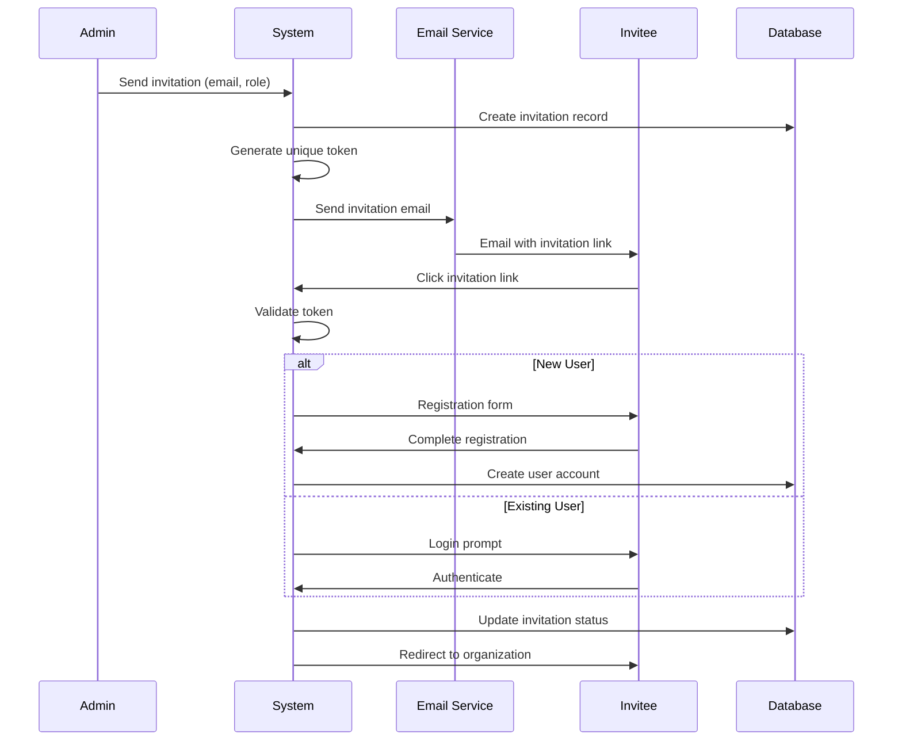

# Invitation System

## Overview

The invitation system allows organization administrators to invite new members to join their organizations. It handles both existing and new users with a secure, streamlined process.

## Invitation States

```typescript
type InvitationStatus = "pending" | "accepted" | "declined" | "revoked";
```

- **pending**: Invitation sent, awaiting response
- **accepted**: Invitation accepted, user is now organization member
- **declined**: Invitation declined by user
- **revoked**: Invitation cancelled by administrator

## Available Roles

```typescript
type OrganizationRole = "admin" | "member";
```

- **admin**: Full organization management, can invite/revoke members, manage projects
- **member**: Access to shared projects, collaboration features

## Invitation Flow



## Database Schema

### Invitation Records

```sql
-- Organization members table with invitation fields
CREATE TABLE organization_members (
  id UUID PRIMARY KEY DEFAULT gen_random_uuid(),
  organization_id UUID REFERENCES organizations(id) ON DELETE CASCADE,
  user_id UUID REFERENCES users(id) ON DELETE CASCADE,
  role TEXT DEFAULT 'member',
  invitation_status TEXT DEFAULT 'pending',
  invitation_token TEXT UNIQUE,
  invited_by UUID REFERENCES users(id),
  invited_at TIMESTAMPTZ DEFAULT NOW(),
  joined_at TIMESTAMPTZ,
  expires_at TIMESTAMPTZ DEFAULT (NOW() + INTERVAL '7 days'),
  created_at TIMESTAMPTZ DEFAULT NOW(),
  UNIQUE(organization_id, user_id)
);
```

## Core Features

### Invitation Creation

- **Email validation**: Ensure valid email format
- **Duplicate prevention**: Check existing memberships
- **Token generation**: Cryptographically secure unique tokens
- **Expiration**: 7-day default expiry for security

### Email Templates

```typescript
// Invitation email template
export const invitationEmailTemplate = {
  subject: (orgName: string) => `Invitation to join ${orgName} on Exodia`,
  html: (inviterName: string, orgName: string, invitationUrl: string) => `
    <h1>You've been invited!</h1>
    <p>${inviterName} has invited you to join <strong>${orgName}</strong> on Exodia.</p>
    <p>Accept your invitation to start collaborating on project proposals.</p>
    <a href="${invitationUrl}">Accept Invitation</a>
    <p><small>This invitation expires in 7 days.</small></p>
  `,
};
```

### Security Features

- **Token-based authentication**: Secure invitation links
- **Expiration handling**: Automatic cleanup of expired invitations
- **Rate limiting**: Prevent invitation spam
- **Permission validation**: Only admins can invite

### User Experience

- **Smart routing**: Automatic redirect based on user state
- **Context preservation**: Remember invitation during registration
- **Error handling**: Clear messaging for expired/invalid tokens
- **Mobile-friendly**: Responsive invitation acceptance flow

## API Endpoints

### Create Invitation

```typescript
POST /api/organizations/{orgId}/invitations
{
  "email": "user@example.com",
  "role": "member"
}
```

### Accept Invitation

```typescript
GET /api/invitations/accept?token={invitationToken}
```

### Revoke Invitation

```typescript
DELETE / api / invitations / { invitationId };
```

## Business Rules

### Invitation Limits

- **Free tier**: 5 pending invitations max
- **Premium tier**: Unlimited invitations
- **Expiry**: 7 days from creation
- **Cleanup**: Automatic removal of expired invitations

### Role Management

- Only **admins** can send invitations
- Invitees receive the role specified during invitation
- Role can be changed after acceptance by admins

## Related Documentation

- See [auth.md](./auth.md) for authentication integration
- See [user-management.md](./user-management.md) for role-based permissions
- See [database.md](./database.md) for schema details

The invitation system ensures secure, user-friendly onboarding while maintaining proper access controls.
