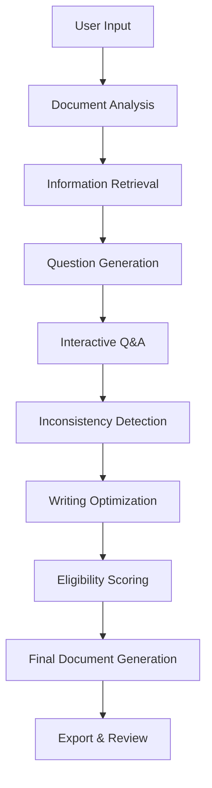

# Project Proposal Generation

## Overview

The project proposal generation system guides users through a structured, AI-assisted workflow to create comprehensive responses to calls for proposals. It combines document analysis, intelligent questioning, and multi-AI processing.

## Generation Workflow



## Processing Steps

### 1. Document Analysis
- **Task**: `analysisDocument`
- **Model**: Native processing
- **Purpose**: Extract and understand source document content
- **Output**: Structured document insights and key requirements

### 2. Project Context Retrieval
- **Task**: `analysisDocument` 
- **Model**: Native processing
- **Purpose**: Gather existing project documents and context
- **Output**: Consolidated project knowledge base

### 3. Additional Information Search
- **Task**: `informationRetrieval`
- **Model**: `sonar-pro`
- **Purpose**: Find relevant information in document base or web
- **Optional**: Yes
- **Output**: Supplementary research findings

### 4. Interactive Question Generation
- **Task**: `questionAnswering`
- **Model**: `gpt-4o-mini`
- **Purpose**: Generate clarifying questions about the project
- **Output**: Strategic questions to improve proposal quality

### 5. Question & Answer Session
- **Task**: `questionAnswering`
- **Model**: `gpt-4o-mini`
- **Purpose**: Interactive assistance on all project aspects
- **Output**: Comprehensive project understanding

### 6. Inconsistency & Risk Detection
- **Task**: `inconsistencyOrRiskDetection`
- **Model**: `gemini-1.5-flash`
- **Purpose**: Critical analysis to avoid errors or omissions
- **Output**: Risk assessment and inconsistency report

### 7. Writing Enhancement
- **Task**: `writingSuggestions`
- **Model**: `claude-3-5-sonnet`
- **Purpose**: Optimize style and clarity of responses
- **Output**: Editorial suggestions and improvements

### 8. Eligibility Scoring
- **Task**: `scoringOrEligibility`
- **Model**: `claude-3-5-sonnet`
- **Purpose**: Automatic evaluation of proposal relevance
- **Output**: Scoring matrix and eligibility assessment

### 9. Final Proposal Writing
- **Task**: `aoWriting`
- **Model**: `claude-3-5-sonnet`
- **Purpose**: Generate final submission-ready document
- **Output**: Complete, formatted proposal document

## Multi-AI Strategy

### Model Selection Rationale

```typescript
interface AIModelStrategy {
  'gpt-4o-mini': {
    tasks: ['questionAnswering', 'questionGeneration'];
    strengths: ['Interactive dialogue', 'Question formulation'];
    cost: 'Low';
  };
  'gemini-1.5-flash': {
    tasks: ['inconsistencyDetection'];
    strengths: ['Critical analysis', 'Fast processing'];
    cost: 'Medium';
  };
  'claude-3-5-sonnet': {
    tasks: ['writingSuggestions', 'aoWriting', 'scoringOrEligibility'];
    strengths: ['Writing quality', 'Document structure'];
    cost: 'High';
  };
  'sonar-pro': {
    tasks: ['informationRetrieval'];
    strengths: ['Web search', 'Current information'];
    cost: 'Medium';
  };
}
```

## User Interface Flow

### Step-by-Step Wizard

```typescript
interface GenerationStep {
  id: string;
  title: string;
  description: string;
  status: 'pending' | 'processing' | 'completed' | 'error';
  isOptional: boolean;
  estimatedTime: string;
  dependencies: string[];
}

const generationSteps: GenerationStep[] = [
  {
    id: 'analysis',
    title: 'Document Analysis',
    description: 'Analyzing uploaded documents and requirements',
    status: 'pending',
    isOptional: false,
    estimatedTime: '2 minutes',
    dependencies: []
  },
  // ... other steps
];
```

### Progress Tracking

- **Visual Progress Bar**: Show completion percentage
- **Step Status**: Individual step completion states
- **Time Estimates**: Expected completion times
- **Parallel Processing**: Show simultaneous AI operations

## Quality Assurance

### Multi-Layer Validation

1. **Content Validation**: Ensure all requirements are addressed
2. **Consistency Check**: Verify information coherence
3. **Style Optimization**: Improve readability and flow
4. **Compliance Verification**: Check against proposal guidelines
5. **Final Review**: Human-in-the-loop validation

### Scoring Framework

```typescript
interface ProposalScore {
  overall: number; // 0-100
  categories: {
    technical: number;
    commercial: number;
    compliance: number;
    innovation: number;
    presentation: number;
  };
  risks: RiskAssessment[];
  recommendations: string[];
}
```

## Export Options

### Document Formats

- **PDF**: Professional submission format
- **DOCX**: Editable Word document
- **Markdown**: Version control friendly
- **JSON**: Structured data export

### Version Control

- **Draft Versions**: Save intermediate versions
- **Change Tracking**: Monitor document evolution
- **Collaboration**: Multi-user editing support
- **Approval Workflow**: Review and approval process

## Performance Optimization

### Parallel Processing

```typescript
const processProposalSteps = async (projectId: string) => {
  // Run independent steps in parallel
  const [analysis, context] = await Promise.all([
    analyzeDocuments(projectId),
    retrieveProjectContext(projectId)
  ]);
  
  // Sequential dependent steps
  const questions = await generateQuestions(analysis, context);
  const answers = await processQuestions(questions);
  
  // Final parallel processing
  const [inconsistencies, suggestions, scoring] = await Promise.all([
    detectInconsistencies(answers),
    generateWritingSuggestions(answers),
    calculateEligibilityScore(answers)
  ]);
  
  return generateFinalProposal(answers, inconsistencies, suggestions, scoring);
};
```

### Caching Strategy

- **Template Caching**: Reuse common proposal structures
- **Analysis Caching**: Cache document analysis results
- **Model Response Caching**: Cache AI responses for similar inputs

## Related Documentation

- See [rag-system.md](./rag-system.md) for document retrieval
- See [document-processing.md](./document-processing.md) for AI pipeline
- See [user-management.md](./user-management.md) for access controls
- See [collaboration.md](./collaboration.md) for team features

This system transforms complex proposal writing into a guided, AI-enhanced workflow that ensures quality and compliance.