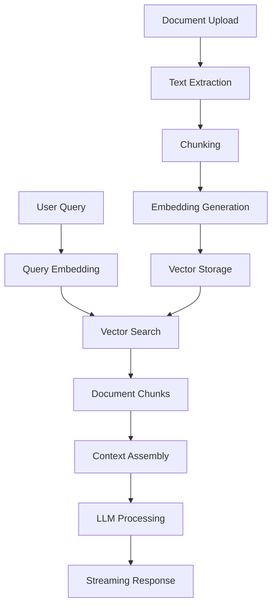

# RAG System (Retrieval-Augmented Generation)

## Overview

Exodia's RAG system enables intelligent document-based conversations by combining semantic search with large language models. Users can ask questions about their uploaded documents and receive contextual, accurate responses.

## Architecture



## Core Components

### 1. Document Processing Pipeline

```typescript
interface DocumentProcessingSteps {
  1: "Text Extraction"; // PDF/DOCX → Plain text
  2: "Content Chunking"; // Split into 500-token chunks
  3: "Embedding Generation"; // OpenAI text-embedding-3-small
  4: "Vector Storage"; // Store in pgvector
  5: "Indexing"; // Create search indexes
}
```

### 2. Vector Search Engine

```sql
-- Semantic search function
CREATE OR REPLACE FUNCTION search_documents(
  query_embedding vector(1536),
  project_uuid UUID,
  match_threshold float DEFAULT 0.8,
  match_count int DEFAULT 10
)
RETURNS TABLE (
  chunk_id UUID,
  document_id UUID,
  content TEXT,
  similarity FLOAT
)
LANGUAGE plpgsql
AS $$
BEGIN
  RETURN QUERY
  SELECT
    dc.id,
    dc.document_id,
    dc.content,
    1 - (dc.embedding <=> query_embedding) as similarity
  FROM document_chunks dc
  JOIN documents d ON dc.document_id = d.id
  WHERE d.project_id = project_uuid
    AND 1 - (dc.embedding <=> query_embedding) > match_threshold
  ORDER BY dc.embedding <=> query_embedding
  LIMIT match_count;
END;
$$;
```

### 3. Context Assembly

```typescript
interface RAGContext {
  query: string;
  relevantChunks: DocumentChunk[];
  conversationHistory: Message[];
  systemPrompt: string;
  maxTokens: number;
}

const assembleContext = (
  query: string,
  chunks: DocumentChunk[],
  history: Message[]
): string => {
  const context = chunks
    .map((chunk) => `Document: ${chunk.filename}\nContent: ${chunk.content}`)
    .join("\n\n");

  return `Based on the following documents, answer the user's question.
  
Context:
${context}

Previous conversation:
${history
  .slice(-3)
  .map((m) => `${m.role}: ${m.content}`)
  .join("\n")}

User question: ${query}

Provide a helpful, accurate response based on the document context.`;
};
```

## Search Strategy

### Hybrid Search Approach

1. **Semantic Search**: Vector similarity for meaning-based matching
2. **Keyword Search**: Full-text search for exact term matches
3. **Reranking**: Combine and rerank results for relevance

```typescript
const hybridSearch = async (
  query: string,
  projectId: string
): Promise<SearchResult[]> => {
  // 1. Generate query embedding
  const embedding = await generateEmbedding(query);

  // 2. Semantic search
  const semanticResults = await searchByVector(embedding, projectId);

  // 3. Keyword search
  const keywordResults = await searchByKeywords(query, projectId);

  // 4. Merge and rerank
  return reRankResults([...semanticResults, ...keywordResults]);
};
```

### Search Optimization

- **Chunk Size**: 500 tokens optimal for context vs. precision
- **Overlap**: 50-token overlap between chunks for continuity
- **Similarity Threshold**: 0.8 minimum for relevance
- **Result Limit**: 10 chunks maximum for context window

## Chat Interface

### Streaming Response

```typescript
// Streaming RAG chat endpoint
export async function POST(request: Request) {
  const { message, projectId, conversationHistory } = await request.json();

  // 1. Search relevant documents
  const relevantChunks = await hybridSearch(message, projectId);

  // 2. Assemble context
  const context = assembleContext(message, relevantChunks, conversationHistory);

  // 3. Stream LLM response
  const stream = await openai.chat.completions.create({
    model: "gpt-4o-mini",
    messages: [{ role: "user", content: context }],
    stream: true,
    temperature: 0.3, // Lower temperature for factual responses
  });

  return new Response(stream);
}
```

### Conversation Management

```typescript
interface ChatMessage {
  id: string;
  role: "user" | "assistant";
  content: string;
  sources?: DocumentSource[];
  timestamp: Date;
  tokenCount: number;
}

interface DocumentSource {
  documentId: string;
  filename: string;
  similarity: number;
  chunkContent: string;
}
```

## Performance Features

### Caching Strategy

```typescript
interface RAGCache {
  queryEmbeddings: Map<string, vector>; // Cache frequent query embeddings
  searchResults: LRUCache<string, SearchResult[]>; // Cache search results
  contextAssembly: Map<string, string>; // Cache assembled contexts
}
```

### Real-time Features

- **Typing Indicators**: Show when AI is processing
- **Progressive Loading**: Stream chunks as they arrive
- **Source Highlighting**: Show relevant document sections
- **Follow-up Suggestions**: Suggest related questions

## Quality Assurance

### Response Accuracy

- **Source Attribution**: Always show document sources
- **Confidence Scoring**: Rate response reliability
- **Hallucination Detection**: Flag potentially inaccurate responses
- **User Feedback**: Thumbs up/down for response quality

### Content Filtering

```typescript
const filterContent = (chunks: DocumentChunk[]): DocumentChunk[] => {
  return chunks.filter((chunk) => {
    // Remove chunks with low relevance
    if (chunk.similarity < 0.8) return false;

    // Remove duplicate content
    if (isDuplicateContent(chunk.content)) return false;

    // Remove metadata-only chunks
    if (isMetadataOnly(chunk.content)) return false;

    return true;
  });
};
```

## Analytics & Monitoring

### Usage Metrics

- **Query Volume**: Track questions per project/user
- **Response Quality**: Monitor user feedback scores
- **Search Performance**: Measure retrieval accuracy
- **Token Usage**: Track LLM costs per organization

### Performance Metrics

- **Search Latency**: Average time for vector search
- **Generation Speed**: Tokens per second for responses
- **Cache Hit Rate**: Efficiency of caching layer
- **Error Rates**: Track failed searches/generations

## Related Documentation

- See [document-processing.md](./document-processing.md) for the 7-step processing pipeline
- See [database.md](./database.md) for vector storage schema
- See [user-management.md](./user-management.md) for access controls
- See [api-reference.md](./api-reference.md) for RAG endpoints

The RAG system provides intelligent, context-aware assistance for project proposal creation and document analysis.
