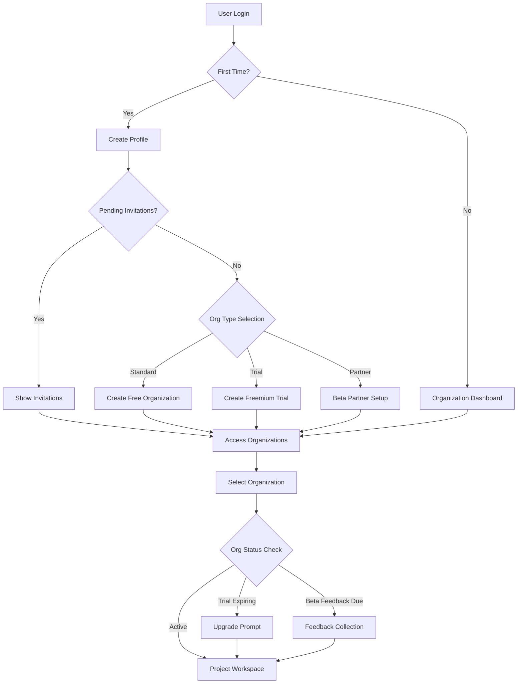

# User Management & Roles

## Overview

Exodia organizes users into **organizations** that contain **projects** (proposal calls). Each project can contain **documents** that feed into a **RAG system** for AI assistance.

## User Hierarchy

```bash
Organization
├── Admin Users (full control)
└── Member Users (limited permissions)
    └── Projects (shared or private)
        └── Documents (RAG-enabled)
```

## Role-Based Access Control

### Organization Roles

```typescript
type OrganizationRole = "admin" | "member";

interface OrganizationMember {
  role: OrganizationRole;
  permissions: Permission[];
  joinedAt: Date;
  invitedBy?: string;
  status: "active" | "suspended";
}
```

### Admin Permissions

**Full organization control:**

- ✅ Create, modify, archive projects
- ✅ Invite and manage members
- ✅ Modify user roles
- ✅ Configure organization settings
- ✅ Access all projects
- ✅ Manage billing and subscriptions
- ✅ View audit logs
- ✅ Delete organization

### Member Permissions

**Limited permissions:**

- ✅ Create projects (if org allows)
- ✅ Access shared projects
- ✅ Upload and manage own documents
- ✅ Use RAG chat system
- ✅ Collaborate on authorized projects
- ❌ Invite new members
- ❌ Modify organization settings
- ❌ Access admin features

## Subscription Tiers

### Free Tier Limits

```typescript
interface FreeTierLimits {
  maxProjects: 3;
  maxDocumentsPerProject: 10;
  maxFileSizeMB: 10;
  maxMembersCount: 5;
  ragQueriesPerMonth: 100;
  features: ["basic_rag", "document_upload"];
}
```

### Premium Tier Features

```typescript
interface PremiumTierFeatures {
  maxProjects: "unlimited";
  maxDocumentsPerProject: "unlimited";
  maxFileSizeMB: 100;
  maxMembersCount: "unlimited";
  ragQueriesPerMonth: "unlimited";
  features: [
    "advanced_rag",
    "document_upload",
    "api_access",
    "export_features",
    "priority_support",
    "audit_logs"
  ];
}
```

### Freemium Trial Tier

```typescript
interface FreemiumTrialFeatures {
  maxProjects: "unlimited";
  maxDocumentsPerProject: "unlimited";
  maxFileSizeMB: 100;
  maxMembersCount: "unlimited";
  ragQueriesPerMonth: "unlimited";
  trialDurationDays: 15 | 30; // Configurable
  features: [
    "advanced_rag",
    "document_upload",
    "export_features",
    "standard_support",
    "upgrade_prompts"
  ];
  restrictions: [
    "watermarked_exports",
    "trial_reminder_banners",
    "limited_api_calls"
  ];
}
```

### Partner Beta Tier

```typescript
interface PartnerBetaFeatures {
  maxProjects: "unlimited";
  maxDocumentsPerProject: "unlimited";
  maxFileSizeMB: 200; // Enhanced for beta testing
  maxMembersCount: "unlimited";
  ragQueriesPerMonth: "unlimited";
  extendedAccess: true; // No fixed expiration
  features: [
    "advanced_rag",
    "document_upload",
    "api_access",
    "export_features",
    "priority_support",
    "audit_logs",
    "beta_features",
    "direct_feedback_channel",
    "early_access_features"
  ];
  betaFeatures: [
    "experimental_ai_models",
    "advanced_analytics",
    "custom_integrations",
    "white_label_options"
  ];
  requirements: [
    "feedback_submissions",
    "monthly_review_calls",
    "bug_reporting",
    "feature_usage_analytics"
  ];
}
```

## Organization Type Management

### Subscription Status Determination

```typescript
type SubscriptionStatus = "free" | "premium" | "freemium_trial" | "partner_beta";

interface OrganizationSubscription {
  status: SubscriptionStatus;
  createdAt: Date;
  expiresAt?: Date; // For trials
  partnershipLevel?: "standard" | "premium" | "enterprise"; // For beta partners
  trialStartedAt?: Date;
  feedbackRequirements?: {
    monthlyReviews: boolean;
    bugReporting: boolean;
    featureUsageAnalytics: boolean;
  };
}
```

### Beta Partner Management

```typescript
// Beta partner specific features
interface BetaPartnerConfig {
  organizationId: string;
  partnershipAgreement: {
    startDate: Date;
    endDate?: Date;
    customLimits?: Partial<OrganizationLimits>;
    specialFeatures: string[];
  };
  feedbackChannel: {
    slackChannelId?: string;
    dedicatedSupport: boolean;
    monthlyCallScheduled: boolean;
  };
  metrics: {
    feedbackSubmissions: number;
    bugReportsSubmitted: number;
    featureUsageData: Record<string, number>;
  };
}
```

### Trial Management System

```typescript
// Freemium trial tracking
interface TrialManagement {
  organizationId: string;
  trialType: "freemium_trial";
  startDate: Date;
  endDate: Date;
  daysRemaining: number;
  conversionMetrics: {
    featuresUsed: string[];
    engagementScore: number;
    upgradePromptsSeen: number;
    conversionLikelihood: "low" | "medium" | "high";
  };
  restrictions: {
    watermarkExports: boolean;
    limitedApiCalls: number;
    showUpgradePrompts: boolean;
  };
}
```

## User Onboarding Flow



## Project Management

### Project Access Control

```typescript
interface ProjectPermissions {
  canView: boolean;
  canEdit: boolean;
  canDelete: boolean;
  canManageDocuments: boolean;
  canUseRAG: boolean;
  canInviteCollaborators: boolean;
}

// Access rules
const getProjectPermissions = (
  userRole: OrganizationRole,
  projectOwner: string,
  userId: string
): ProjectPermissions => {
  const isOwner = projectOwner === userId;
  const isAdmin = userRole === "admin";

  return {
    canView: true, // All org members can view
    canEdit: isOwner || isAdmin,
    canDelete: isOwner || isAdmin,
    canManageDocuments: isOwner || isAdmin,
    canUseRAG: true, // All org members can use RAG
    canInviteCollaborators: isOwner || isAdmin,
  };
};
```

### Project Lifecycle

1. **Creation**: Admin or member creates project
2. **Configuration**: Set privacy, collaborators, RAG settings
3. **Document Upload**: Add relevant documents for processing
4. **AI Processing**: Documents vectorized for RAG system
5. **Collaboration**: Team members use RAG chat
6. **Completion**: Archive or export final proposal

## Technical Implementation

### Database Schema Updates

```sql
-- Add new subscription statuses to organizations table
ALTER TABLE organizations 
ADD COLUMN IF NOT EXISTS subscription_status 
TEXT CHECK (subscription_status IN ('free', 'premium', 'freemium_trial', 'partner_beta')) 
DEFAULT 'free';

-- Trial management table
CREATE TABLE IF NOT EXISTS organization_trials (
  id UUID PRIMARY KEY DEFAULT gen_random_uuid(),
  organization_id UUID NOT NULL REFERENCES organizations(id) ON DELETE CASCADE,
  trial_type TEXT NOT NULL CHECK (trial_type IN ('freemium_trial', 'partner_beta')),
  start_date TIMESTAMPTZ NOT NULL DEFAULT NOW(),
  end_date TIMESTAMPTZ,
  is_active BOOLEAN DEFAULT TRUE,
  conversion_data JSONB,
  created_at TIMESTAMPTZ DEFAULT NOW(),
  updated_at TIMESTAMPTZ DEFAULT NOW()
);

-- Beta partner configuration table
CREATE TABLE IF NOT EXISTS beta_partner_configs (
  id UUID PRIMARY KEY DEFAULT gen_random_uuid(),
  organization_id UUID NOT NULL REFERENCES organizations(id) ON DELETE CASCADE,
  partnership_level TEXT NOT NULL CHECK (partnership_level IN ('standard', 'premium', 'enterprise')),
  special_features TEXT[] DEFAULT '{}',
  feedback_requirements JSONB DEFAULT '{}',
  metrics JSONB DEFAULT '{}',
  created_at TIMESTAMPTZ DEFAULT NOW(),
  updated_at TIMESTAMPTZ DEFAULT NOW()
);
```

### Feature Flag System

```typescript
// Feature flag management for different organization types
interface FeatureFlags {
  // Core features available to all
  basicRAG: boolean;
  documentUpload: boolean;
  
  // Premium features
  advancedRAG: boolean;
  apiAccess: boolean;
  exportFeatures: boolean;
  auditLogs: boolean;
  
  // Beta features (partner_beta only)
  experimentalAI: boolean;
  advancedAnalytics: boolean;
  customIntegrations: boolean;
  whiteLabel: boolean;
  
  // Trial restrictions (freemium_trial)
  watermarkedExports: boolean;
  upgradePrompts: boolean;
  limitedApiCalls: boolean;
}

// Feature flag resolver
export function getFeatureFlags(
  subscriptionStatus: SubscriptionStatus,
  trialInfo?: TrialManagement,
  betaConfig?: BetaPartnerConfig
): FeatureFlags {
  const baseFlags: FeatureFlags = {
    basicRAG: true,
    documentUpload: true,
    advancedRAG: false,
    apiAccess: false,
    exportFeatures: false,
    auditLogs: false,
    experimentalAI: false,
    advancedAnalytics: false,
    customIntegrations: false,
    whiteLabel: false,
    watermarkedExports: false,
    upgradePrompts: false,
    limitedApiCalls: false,
  };

  switch (subscriptionStatus) {
    case 'premium':
      return {
        ...baseFlags,
        advancedRAG: true,
        apiAccess: true,
        exportFeatures: true,
        auditLogs: true,
      };

    case 'freemium_trial':
      return {
        ...baseFlags,
        advancedRAG: true,
        exportFeatures: true,
        watermarkedExports: true,
        upgradePrompts: true,
        limitedApiCalls: true,
      };

    case 'partner_beta':
      return {
        ...baseFlags,
        advancedRAG: true,
        apiAccess: true,
        exportFeatures: true,
        auditLogs: true,
        experimentalAI: true,
        advancedAnalytics: true,
        customIntegrations: betaConfig?.partnershipAgreement.specialFeatures.includes('custom_integrations') ?? false,
        whiteLabel: betaConfig?.partnershipAgreement.specialFeatures.includes('white_label') ?? false,
      };

    default:
      return baseFlags;
  }
}
```

### Automated Trial Management

```typescript
// Trial expiration handling
export async function checkTrialExpirations() {
  const expiringTrials = await supabase
    .from('organization_trials')
    .select(`
      *,
      organizations (
        id,
        name,
        subscription_status
      )
    `)
    .eq('is_active', true)
    .lt('end_date', new Date(Date.now() + 7 * 24 * 60 * 60 * 1000)) // 7 days warning
    .eq('trial_type', 'freemium_trial');

  for (const trial of expiringTrials.data || []) {
    // Send expiration warning email
    await sendTrialExpirationWarning(trial);
    
    // Update conversion metrics
    await updateConversionMetrics(trial.organization_id);
  }
}

// Beta feedback collection
export async function collectBetaFeedback(organizationId: string) {
  const betaConfig = await supabase
    .from('beta_partner_configs')
    .select('*')
    .eq('organization_id', organizationId)
    .single();

  if (betaConfig.data?.feedback_requirements?.monthlyReviews) {
    // Schedule monthly review call
    await scheduleMonthlyReview(organizationId);
  }

  if (betaConfig.data?.feedback_requirements?.bugReporting) {
    // Send bug report reminder
    await sendBugReportReminder(organizationId);
  }
}
```

## Security Features

### Enhanced Row Level Security (RLS)

```sql
-- Users can only access their organization's data
CREATE POLICY "org_isolation" ON projects
FOR ALL USING (
  organization_id IN (
    SELECT organization_id FROM organization_members
    WHERE user_id = auth.uid()
    AND invitation_status = 'accepted'
  )
);

-- Beta feature access control
CREATE POLICY "beta_feature_access" ON beta_partner_configs
FOR ALL USING (
  organization_id IN (
    SELECT organization_id FROM organization_members
    WHERE user_id = auth.uid()
    AND invitation_status = 'accepted'
  )
);

-- Trial data access control
CREATE POLICY "trial_data_access" ON organization_trials
FOR ALL USING (
  organization_id IN (
    SELECT organization_id FROM organization_members
    WHERE user_id = auth.uid()
    AND invitation_status = 'accepted'
  )
);
```

### Audit Logging

```typescript
interface AuditLog {
  id: string;
  organizationId: string;
  userId: string;
  action: "create" | "update" | "delete" | "invite" | "login";
  resource: "project" | "document" | "member" | "organization";
  resourceId: string;
  metadata: Record<string, any>;
  timestamp: Date;
  ipAddress: string;
  userAgent: string;
}
```

## User Interface Patterns

### Responsive Navigation

- **Desktop**: Sidebar with organization switcher
- **Mobile**: Bottom navigation with context awareness
- **Tablet**: Collapsible sidebar with gesture support

### Permission-Based UI

```typescript
// Component visibility based on permissions
const ProjectActions = ({ userRole, isOwner, project }) => {
  const canEdit = userRole === "admin" || isOwner;
  const canDelete = userRole === "admin" || isOwner;

  return (
    <ActionBar>
      <ViewButton /> {/* Always visible */}
      {canEdit && <EditButton />}
      {canDelete && <DeleteButton />}
      <ShareButton />
    </ActionBar>
  );
};
```

## Related Documentation

- See [auth.md](./auth.md) for authentication flows
- See [invitation-system.md](./invitation-system.md) for member invitations
- See [database.md](./database.md) for RLS implementation
- See [rag-system.md](./rag-system.md) for AI assistance features

This role-based system ensures secure, scalable user management while maintaining intuitive user experience.
