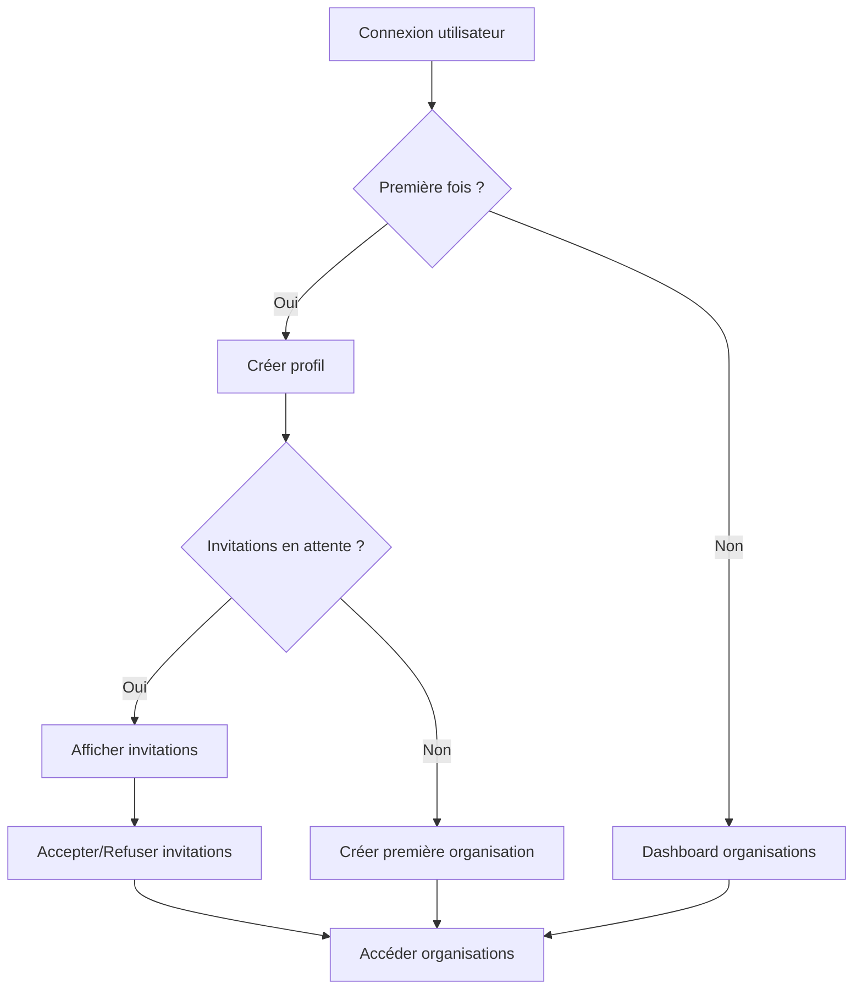
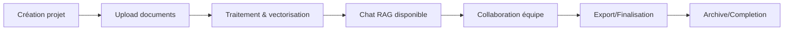

# Flux utilisateur et rôles

## Vue d'ensemble

Exodia organise les utilisateurs en **organisations** qui contiennent des **projets** (appels d'offres). Chaque projet peut contenir des **documents** qui alimentent un système **RAG** pour l'assistance IA.

## Onboarding

- User account creation
- Organization creation
- Organization context completion
- Project creation
- Project context completion

## Architecture des rôles

### Rôles organisationnels

```typescript
type OrganizationRole = "admin" | "member";

interface OrganizationMember {
  role: OrganizationRole;
  permissions: Permission[];
  joinedAt: Date;
  invitedBy?: string;
}
```

#### Admin (Administrateur)

**Permissions complètes sur l'organisation :**

- ✅ Créer, modifier, archiver des projets
- ✅ Inviter et gérer les membres
- ✅ Modifier les rôles des utilisateurs
- ✅ Configurer les paramètres de l'organisation
- ✅ Accéder à tous les projets
- ✅ Gérer la facturation et l'abonnement
- ✅ Consulter les logs d'audit

#### Member (Membre)

**Permissions limitées :**

- ✅ Créer des projets (selon config organisation)
- ✅ Accéder aux projets partagés
- ✅ Upload et gérer ses documents
- ✅ Utiliser le chat RAG
- ✅ Collaborer sur les projets autorisés
- ❌ Inviter de nouveaux membres
- ❌ Modifier les paramètres de l'organisation

### Statuts d'organisation

```typescript
type SubscriptionStatus = "free" | "premium" | "freemium_trial" | "partner_beta";

interface OrganizationLimits {
  maxProjects: number;
  maxDocumentsPerProject: number;
  maxFileSizeMB: number;
  maxMembersCount: number;
  ragQueriesPerMonth: number;
  features: Feature[];
  trialDurationDays?: number;
  betaFeatures?: string[];
}
```

#### Free (Gratuit)

- 3 projets maximum
- 10 documents par projet
- 10 MB par fichier
- 5 membres maximum
- 100 requêtes RAG/mois
- Support email uniquement

#### Premium (Payant)

- Projets illimités
- Documents illimités
- 100 MB par fichier
- Membres illimités
- Requêtes RAG illimitées
- Support prioritaire
- Fonctionnalités avancées (exports, API, etc.)

#### Freemium Trial (Essai pro)

- Toutes les fonctionnalités Premium
- Durée limitée (15-30 jours configurables)
- Pour évaluation avant achat
- Support standard
- Prompts d'upgrade automatiques
- Analytics d'utilisation pour conversion

#### Partner Beta (Partenaire beta)

- Toutes les fonctionnalités Premium
- Accès aux fonctionnalités expérimentales
- Durée étendue selon partenariat
- Support prioritaire dédié
- Canal de feedback direct avec l'équipe
- Badge spécial dans l'interface
- Limites personnalisées selon accord
- Collecte obligatoire de retours d'expérience

## Flux utilisateur principal

### 1. Onboarding initial

**Première connexion :**



**Création d'organisation :**

```typescript
// Flux de création d'organisation
export async function createOrganization(data: {
  name: string;
  slug: string;
  description?: string;
  userId: string;
}) {
  // 1. Créer l'organisation
  const { data: org } = await supabase
    .from("organizations")
    .insert({
      name: data.name,
      slug: data.slug,
      description: data.description,
      created_by: data.userId,
      subscription_status: "free", // or "freemium_trial" | "partner_beta"
    })
    .select()
    .single();

  // 2. Ajouter le créateur comme admin
  await supabase.from("organization_members").insert({
    organization_id: org.id,
    user_id: data.userId,
    role: "admin",
    invitation_status: "accepted",
    joined_at: new Date().toISOString(),
  });

  return org;
}
```

### 2. Gestion des projets

**Cycle de vie d'un projet :**



**Interface de création de projet :**

```tsx
// app/organizations/[slug]/projects/new/page.tsx
export default function NewProjectPage() {
  const [projectData, setProjectData] = useState({
    name: "",
    description: "",
    isPrivate: false,
  });

  const handleCreateProject = async () => {
    const { data: project } = await supabase
      .from("projects")
      .insert({
        name: projectData.name,
        description: projectData.description,
        organization_id: organization.id,
        created_by: user.id,
        status: "active",
      })
      .select()
      .single();

    // Rediriger vers le projet créé
    router.push(`/organizations/${orgSlug}/projects/${project.id}`);
  };

  return (
    <div className="max-w-2xl mx-auto">
      <h1>Nouveau projet</h1>
      <form onSubmit={handleCreateProject}>
        <Input
          placeholder="Nom du projet"
          value={projectData.name}
          onChange={(e) =>
            setProjectData((prev) => ({ ...prev, name: e.target.value }))
          }
        />
        <Textarea
          placeholder="Description du projet"
          value={projectData.description}
          onChange={(e) =>
            setProjectData((prev) => ({ ...prev, description: e.target.value }))
          }
        />
        <Button type="submit">Créer le projet</Button>
      </form>
    </div>
  );
}
```

### 3. Gestion des documents

**Pipeline de traitement des documents :**

```typescript
// Flux d'upload et traitement
export async function uploadDocument(file: File, projectId: string) {
  // 1. Upload vers Supabase Storage
  const fileName = `${projectId}/${crypto.randomUUID()}-${file.name}`;
  const { data: uploadData } = await supabase.storage
    .from("documents")
    .upload(fileName, file);

  // 2. Créer l'enregistrement document
  const { data: document } = await supabase
    .from("documents")
    .insert({
      project_id: projectId,
      filename: fileName,
      original_filename: file.name,
      file_path: uploadData.path,
      file_size: file.size,
      mime_type: file.type,
      status: "processing",
      uploaded_by: user.id,
    })
    .select()
    .single();

  // 3. Déclencher le traitement asynchrone
  await triggerDocumentProcessing(document.id);

  return document;
}

async function triggerDocumentProcessing(documentId: string) {
  // Appel Edge Function pour extraction et vectorisation
  await fetch("/api/process-document", {
    method: "POST",
    body: JSON.stringify({ documentId }),
    headers: { "Content-Type": "application/json" },
  });
}
```

**États de traitement des documents :**

- **processing** : Document en cours de traitement
- **completed** : Traitement terminé, prêt pour RAG
- **failed** : Erreur lors du traitement

### 4. Interface RAG (Chat)

**Composant de chat intelligent :**

```tsx
// components/project/chat-interface.tsx
export function ChatInterface({ projectId }: { projectId: string }) {
  const [messages, setMessages] = useState<ChatMessage[]>([]);
  const [input, setInput] = useState("");
  const [isLoading, setIsLoading] = useState(false);

  const sendMessage = async () => {
    setIsLoading(true);

    const userMessage: ChatMessage = {
      role: "user",
      content: input,
      timestamp: new Date(),
    };

    setMessages((prev) => [...prev, userMessage]);

    try {
      const response = await fetch("/api/chat", {
        method: "POST",
        body: JSON.stringify({
          projectId,
          message: input,
          conversationHistory: messages.slice(-10), // Limiter le contexte
        }),
        headers: { "Content-Type": "application/json" },
      });

      const { content, sources } = await response.json();

      const assistantMessage: ChatMessage = {
        role: "assistant",
        content,
        sources,
        timestamp: new Date(),
      };

      setMessages((prev) => [...prev, assistantMessage]);
    } catch (error) {
      console.error("Erreur lors de l'envoi:", error);
    } finally {
      setIsLoading(false);
      setInput("");
    }
  };

  return (
    <div className="flex flex-col h-full">
      {/* Zone de messages */}
      <div className="flex-1 overflow-y-auto p-4 space-y-4">
        {messages.map((message, index) => (
          <ChatMessage key={index} message={message} />
        ))}
      </div>

      {/* Input de saisie */}
      <div className="border-t p-4">
        <div className="flex gap-2">
          <Input
            value={input}
            onChange={(e) => setInput(e.target.value)}
            placeholder="Posez votre question sur les documents..."
            onKeyPress={(e) => e.key === "Enter" && sendMessage()}
          />
          <Button onClick={sendMessage} disabled={isLoading}>
            {isLoading ? <Loader2 className="animate-spin" /> : <Send />}
          </Button>
        </div>
      </div>
    </div>
  );
}
```

### 5. Collaboration en temps réel

**Fonctionnalités collaboratives :**

- **Présence** : Voir qui est connecté sur le projet
- **Activité** : Journal des actions en temps réel
- **Partage** : Partager des conversations et insights
- **Notifications** : Alertes sur les activités importantes

```tsx
// hooks/use-presence.ts
export function usePresence(projectId: string) {
  const [onlineUsers, setOnlineUsers] = useState<User[]>([]);

  useEffect(() => {
    const channel = supabase
      .channel(`project:${projectId}`)
      .on("presence", { event: "sync" }, () => {
        const state = channel.presenceState();
        const users = Object.values(state).flat();
        setOnlineUsers(users as User[]);
      })
      .on("presence", { event: "join" }, ({ newPresences }) => {
        console.log("Utilisateur connecté:", newPresences);
      })
      .on("presence", { event: "leave" }, ({ leftPresences }) => {
        console.log("Utilisateur déconnecté:", leftPresences);
      })
      .subscribe(async (status) => {
        if (status === "SUBSCRIBED") {
          await channel.track({
            user_id: user.id,
            user_name: user.full_name,
            online_at: new Date().toISOString(),
          });
        }
      });

    return () => {
      supabase.removeChannel(channel);
    };
  }, [projectId]);

  return { onlineUsers };
}
```

## Notifications système

**Types de notifications :**

```typescript
type NotificationType =
  | "invitation"
  | "document_processed"
  | "project_shared"
  | "mention"
  | "deadline_reminder"
  | "system_update";

interface Notification {
  type: NotificationType;
  title: string;
  message: string;
  actionUrl?: string;
  read: boolean;
  createdAt: Date;
}
```

**Système de notifications en temps réel :**

- **In-app** : Notifications dans l'interface (toast, badge)
- **Email** : Résumés quotidiens/hebdomadaires
- **Push** : Notifications mobiles (futur)

## Analyse et détection d'incohérences

**Fonctionnalités d'analyse IA :**

```typescript
// Analyse automatique des documents
export async function analyzeDocuments(projectId: string) {
  const documents = await getProjectDocuments(projectId);

  // Analyse des incohérences via IA
  const analysis = await openai.chat.completions.create({
    model: "gpt-4",
    messages: [
      {
        role: "system",
        content:
          "Analyse les documents et identifie les incohérences, contradictions ou informations manquantes.",
      },
      {
        role: "user",
        content: `Analyse ces documents : ${documents
          .map((d) => d.extracted_text)
          .join("\n\n")}`,
      },
    ],
  });

  return {
    inconsistencies: analysis.choices[0].message.content,
    recommendations: generateRecommendations(analysis),
  };
}
```

Ce flux utilisateur garantit une expérience fluide et intuitive tout en maintenant la sécurité et les permissions appropriées à chaque niveau.
